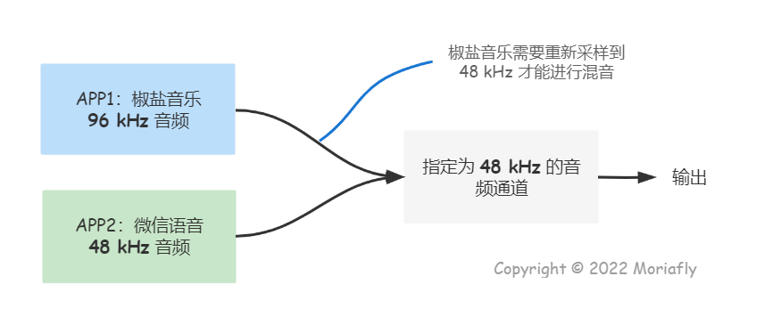
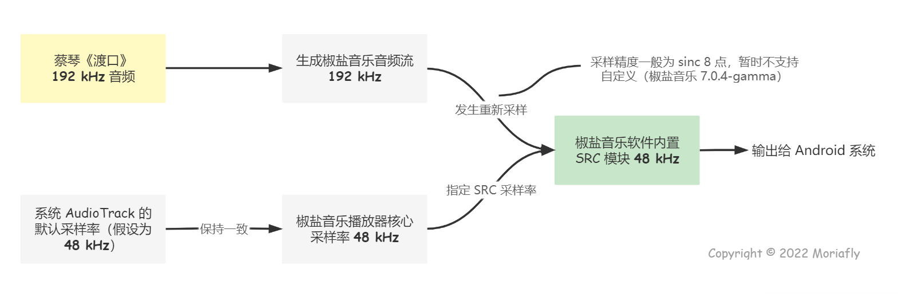
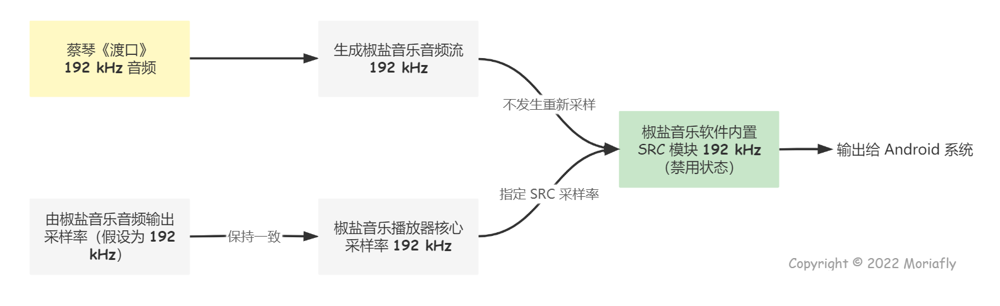

# 椒盐音乐开发者带你了解一些音频知识

:::tip Moriafly
版权所有，未经允许不可转载
:::

:::tip 参考
- [https://source.android.com/devices/audio](https://source.android.com/devices/audio)
- [https://thewelltemperedcomputer.com](https://thewelltemperedcomputer.com)
:::

## 前言

## 采样率转换（SRC）

采样率转换是将具有某一采样率的离散样本流更改为具有另一采样率的流的过程。采样率转换器（即重采样器）是执行采样率转换的模块。对于重采样器，原始流称为源信号，而重新采样的流称为设备信号。

在 Android 中有多处需要用到重采样器。例如，MP3 文件可能以 44. 1kHz 的采样率编码，但需要在内部支持 48 kHz 音频的 Android 设备上进行播放。在这种情况下，会使用重采样器将 MP3 输出音频从 44.1 kHz 源采样率升采样到 Android 设备中使用的 48 kHz 设备采样率。

Android 系统支持多个音频流。你正在观看视频，但你也希望听到电子邮件通知，不至于看电影的时候来了电子邮件通知会打断视频的音频（不考虑音频焦点，音频焦点仅是为了提高用户体验）。简而言之，就是不同的软件可以同时发出声音（如你需要一边打游戏一边听音乐）。那么这是怎么实现的？

这只能通过混合音频和系统声音来实现。只有当两个流以相同的采样率运行时才能进行混合，因为我们的 DAC 不能同时以不同的时钟速度运行。

即使在单个流的情况下，也可能需要重新采样，例如 你有 24 位 / 192 kHz 的音频，但你的硬件仅限于 24 位 / 96 kHz。

也就是说系统指定一个特定的采样率音频通道，所有的通过此的音频流都会重新采样为指定采样率。

举个例子，如下图，椒盐音乐创建了一个 96 kHz 的音频流，并将其输出给系统，若指定的音频通道为 48 kHz，那么将会发生采样率转换为 48 kHz 。而图中微信语音输出为 48 kHz ，与指定一致便不需要进行采样率转换。

采样率转换不应影响音质。但编写一个好的 SRC 并非易事。

:::tip 原生采样率
大多数手机具有 48 kHz 的固定原生采样率。这意味着必须将所有音频重新采样到此速率才能进行本地播放。请注意，这是手机的属性，而不是 Android 固有的限制。
:::

## 是否要追求高位深度？

## Android 重采样器实现

可用的重新采样器实现会频繁变化，并且可由原始设备制造商 (OEM) 自定义。默认重新采样器包括（按照信号失真降序和计算复杂度升序的顺序）：

- 线性
- 立方
- 具有原始系数的 sinc
- 具有修订系数的 sinc

一般来说，sinc 重采样器更适合用来播放品质较高的音乐，而其他重采样器也应保留下来，以便在质量要求不那么高的情况（例如“按键声”或类似情况）下使用。

所选择的特定重采样器实现取决于使用情形、负载以及系统属性 af.resampler.quality 的值。

## 椒盐音乐的重采样策略

假设你现在有一个音频文件，蔡琴的《渡口》，它是 192 kHz 的。

#### 默认情况

此能保证椒盐音乐的音频不经过 Android 系统的 SRC 算法。椒盐音乐使用了高品质的 SRC 算法（正弦 8 点精度），平衡 CPU 占用和品质，后续也会提供更高品质的算法。

#### 开启实验性强制输出

::: warning 可能引发二次 SRC
若指定的音频输出采样率和音频不一致，则在椒盐音乐内部会继续 SRC ，重采样到你指定的采样率，输出给 Android 系统。

若此音频为找到合适的音频输出通道或者请求高采样输出通道失败，则会通过 Android 系统继续再次重新采样，可能会造成系统 audio_server 严重负载，造成高 CPU 消耗）。

且以上操作可能会劣化音质。
:::

## Android 音频架构

