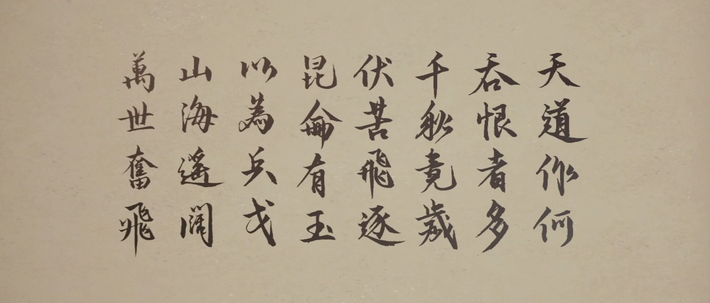

# 作者介绍

## 个人技术

软件工程专业

Android 业余开发

## 个人历程

| Moriafly |  | 
| :-- | :-- |
| 20 年 6 月以前 | 我把往事扔进了风里我没犹豫你也别找寻~ |
| 20 年 6 月 | 自学 Android 开发，喜欢文字写作。还有转专业的一些事情，挺幸运的 |
| 20 年 7 月 | 开发 Foyou 软件 1、2、3、4 代 |
| 20 年 9 月 | 开发 Dso Music |
| 20 年 11 月 | 感谢自己一路坚持，最难的一段时光 |
| **2021** ||
| 21 年 2 月 | 构思椒盐音乐 |
| 21 年 4 月 23 日 | 椒盐音乐在酷安发布第一个正式版本 |
| 21 年 6 月 | 一年来软件用户突破 10 万 |
| 21 年 10 月 | 椒盐音乐上架 Google Play |
| **2022** ||
| 22 年 1 月 | 椒盐音乐 Pro 上线 |
| 22 年 2 月 | 软件总用户突破 20 万 |

未来可期！

## 作者日常之游戏

国单很喜欢，也一直支持着，有时候想着自己若回到 20 年 6 月那个无聊的夏日会不会选择从事游戏行业。我想过，也实践过，但我放弃了。所以我很赞美烛龙的开发者，古剑奇谭里还留住单机梦 ~ 也不时也会回想起仙四的结局，那一句：

“——大宇最小研发团队上海软星”

可能传承这一话题永远留存在有些国单开发者心中。

玩过的武侠国单：《仙剑一》、《仙剑四》、《仙剑六》、《仙剑七》、《轩辕剑三》、《轩辕剑三外天之痕》、《轩辕剑柒》、《古剑奇谭一》、《古剑奇谭三》。

永远支持！

最喜欢的游戏：[《古剑奇谭三：梦付千秋星垂野》](https://gjqt3.wangyuan.com/)。永远喜欢小缨子 ~ 头像、图片都搞成古剑🥰！

## 联系方式

邮箱 moriafly@163.com

QQ 2456860197